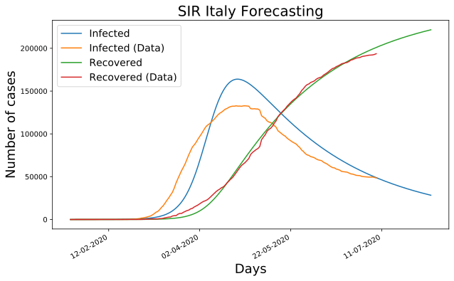
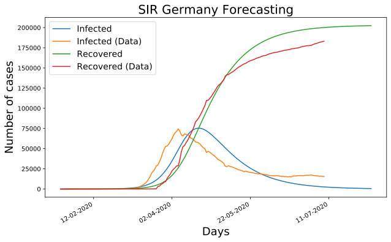

# SIR Time Series Estimation

Command Line Tool to forecast a disease spreading in a population (COVID-19) using an SIR (Susceptible-Infected-Recovered) based architecture. This model is currently designed to first best fit actual COVID-19 data of a chosen country to estimate it's best possible parameters and then forecast a chosen number of days ahead in time making use of the estimated parameters from the data. 

In order to obtain good results, it is important to choose appropriately the model initial conditions (eg. using a initial number of susceptible individuals in the population similar to the peak number of infected in the data can be a good starting point). Using number of susceptible similar to actual country sizes (eg. 50 millions, etc...) would then lead to a considerable increase in the execution running time. 

The model can be easily run by terminal (with the default parameters) using the following command from the current repository location. The output image of the simulation will then be available as an SVG image in the current directory.

```
python time_series.py
```

Some model parameters, can then be explicitly specified as shown in for the example in the command below:

```
python time_series.py --country=France --s0=3000
```

More information and options can be found at:

```
python time_series.py --help
```

In the figures below, are available the prediction results of Italy and Germany as of the 9th of July 2020 in order to predict the following 30 days trends. As can been seen from the results, both countries have been fairly well approximated and the number of infected predicted in the simulation have been slightly overestimated. This mismatch although, can still look quite realistic in real life because of the limited amount of tests available and presence of asymptomatic patients.






```
# Example Terminal Output
Using as Parameters:
country : France
days : 30
s0 : 3000
i0 : 2
      fun: 51918.20168475295
 hess_inv: <2x2 LbfgsInvHessProduct with dtype=float64>
      jac: array([-0.17389539,  0.56534191])
  message: b'CONVERGENCE: REL_REDUCTION_OF_F_<=_FACTR*EPSMCH'
     nfev: 63
      nit: 4
     njev: 21
   status: 0
  success: True
        x: array([0.07289382, 0.0616727 ])
country=France, beta=0.07289382, gamma=0.06167270, r_0:1.18194638
```